#SQL prework exercises

## Lessons 1-6 SQL Queries

- SELECT statement starts the query
- FROM is the table you want to query
- WHERE (then condition) allows to add constraints
  - standard numerical operators work, (=, !=, < <=, >, >=)
  - (BETWEEN... AND)
  - (NOT BETWEEN … AND … )
  - IN (…)
  - NOT IN (…)
  - Filtering
  - ORDER BY column ASC/DESC
  - LIMIT num_limit OFFSET num_offset
- To Query Multiple tables with JOIN
  - INNER JOIN another_table 
    ON mytable.id = another_table.id

## Lessons 13 through 18 - Database Management

- Inserting new data
   - INSERT INTO mytable
(column, another_column, …)
VALUES (value_or_expr, another_value_or_expr, …),
      (value_or_expr_2, another_value_or_expr_2, …),
      …;
- Updating rows
  - UPDATE mytable
SET column = value_or_expr, 
    other_column = another_value_or_expr, 
    …
WHERE condition;
  - TIP is to test the WHERE condition in a SELECT query to make sure it is targeting the correct row(s)
- Deleting Rows
  - DELETE FROM mytable
WHERE condition;
- Creating new tables
  - CREATE TABLE IF NOT EXISTS mytable (
    column DataType TableConstraint DEFAULT default_value,
    another_column DataType TableConstraint DEFAULT default_value,
    …
);
- Altering Tables
  - ALTER TABLE mytable
ADD column DataType OptionalTableConstraint 
    DEFAULT default_value;
- Dropping Tables (deletes Schema)
  - DROP TABLE IF EXISTS mytable;

## SS of completed lessons

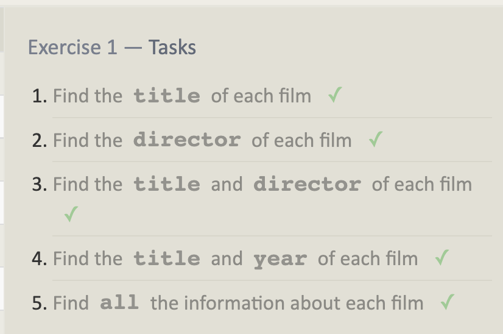
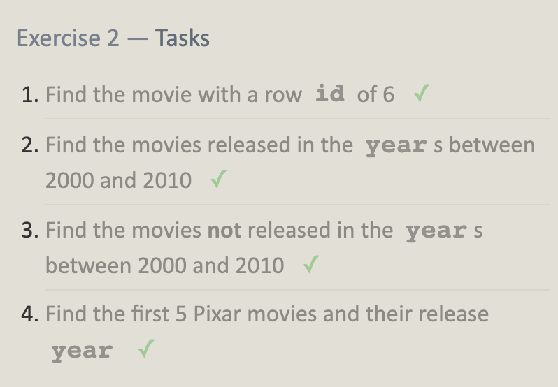
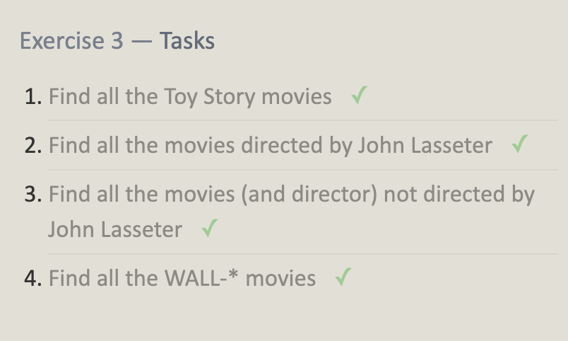
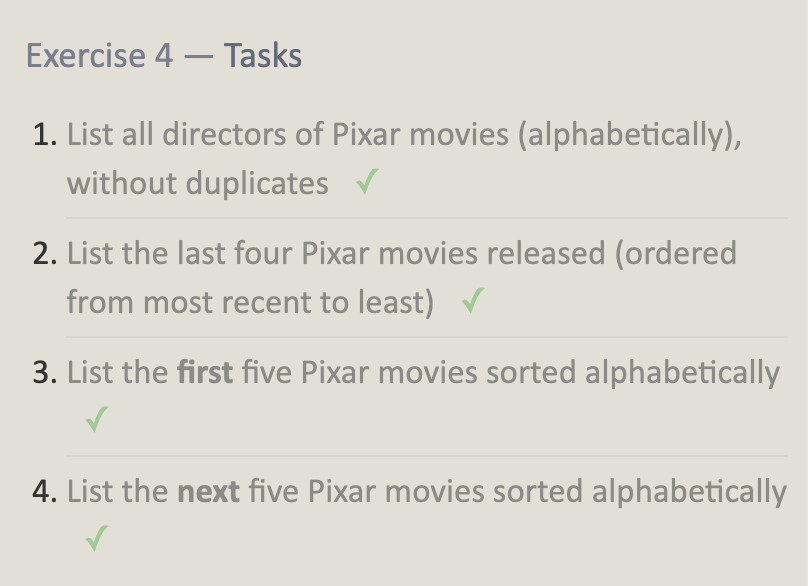
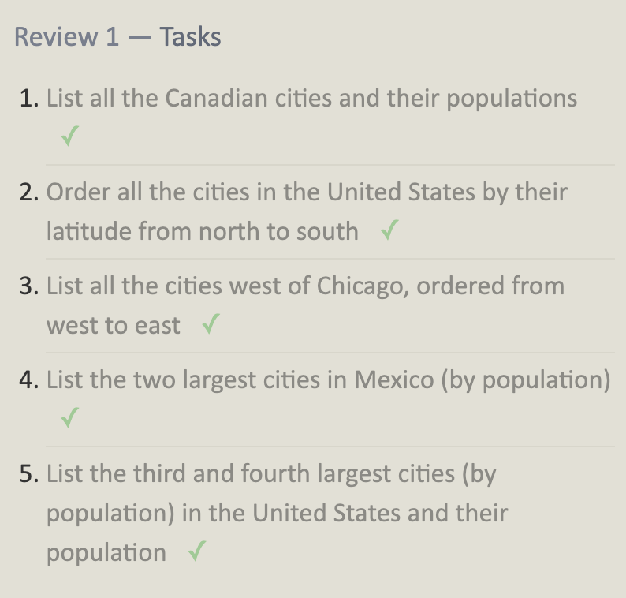
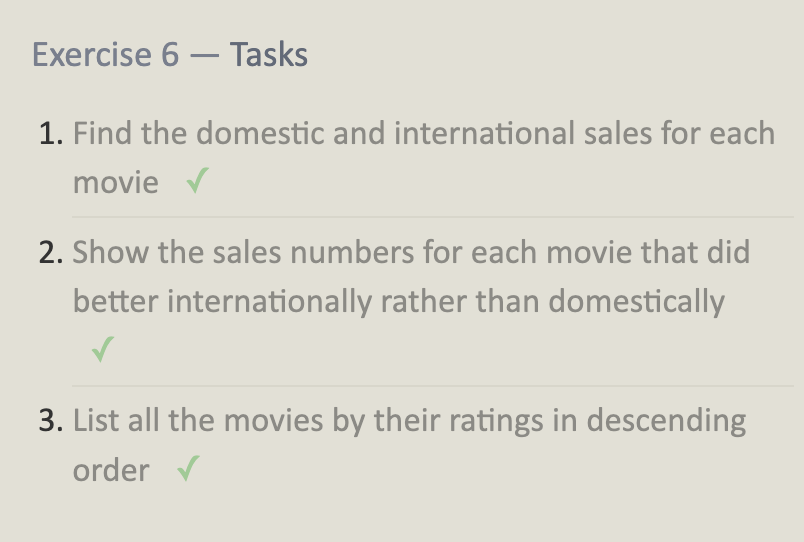

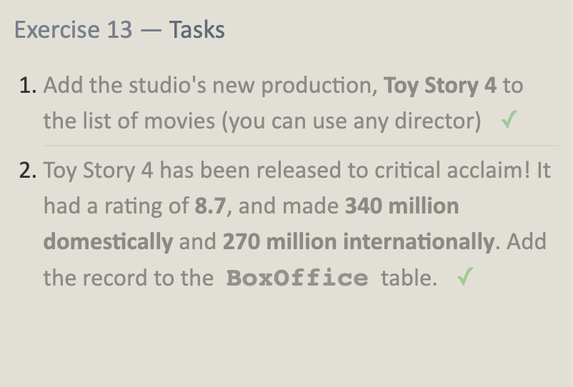
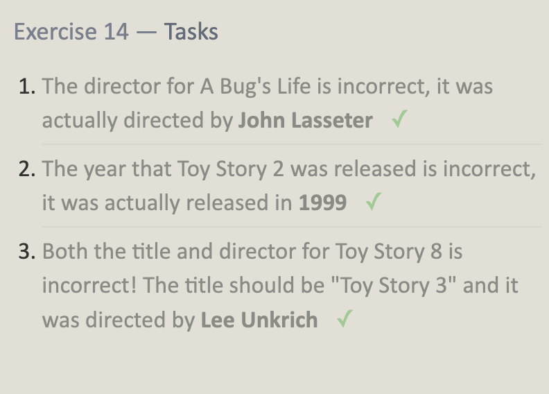
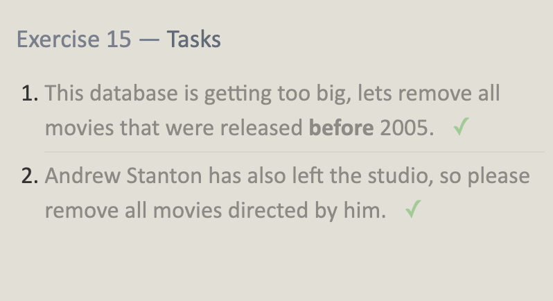
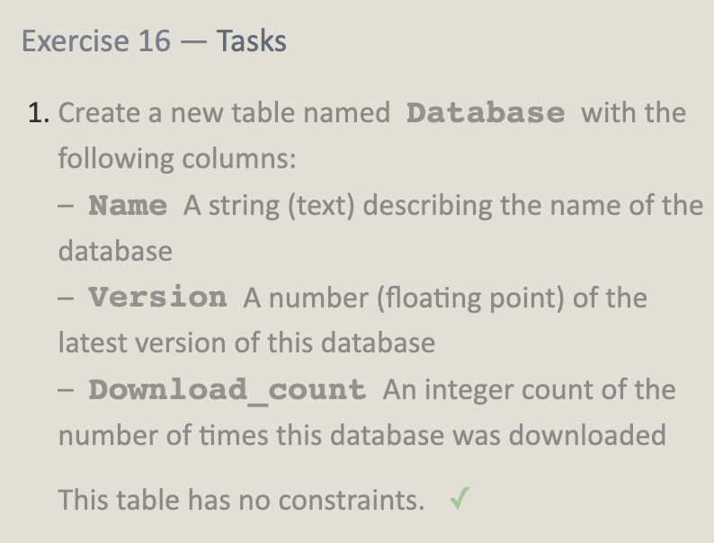
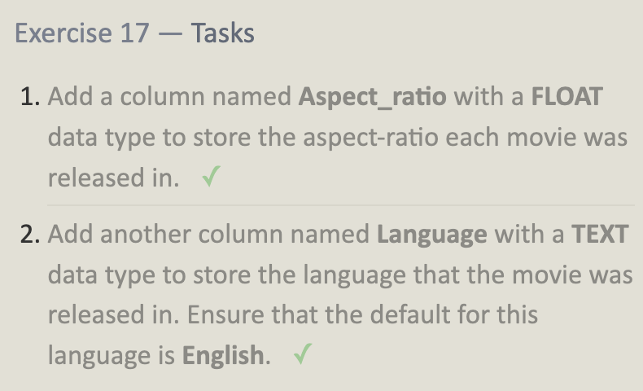
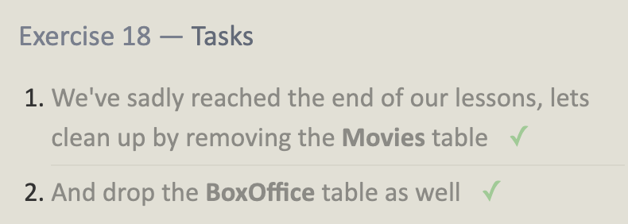